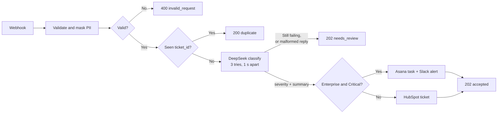
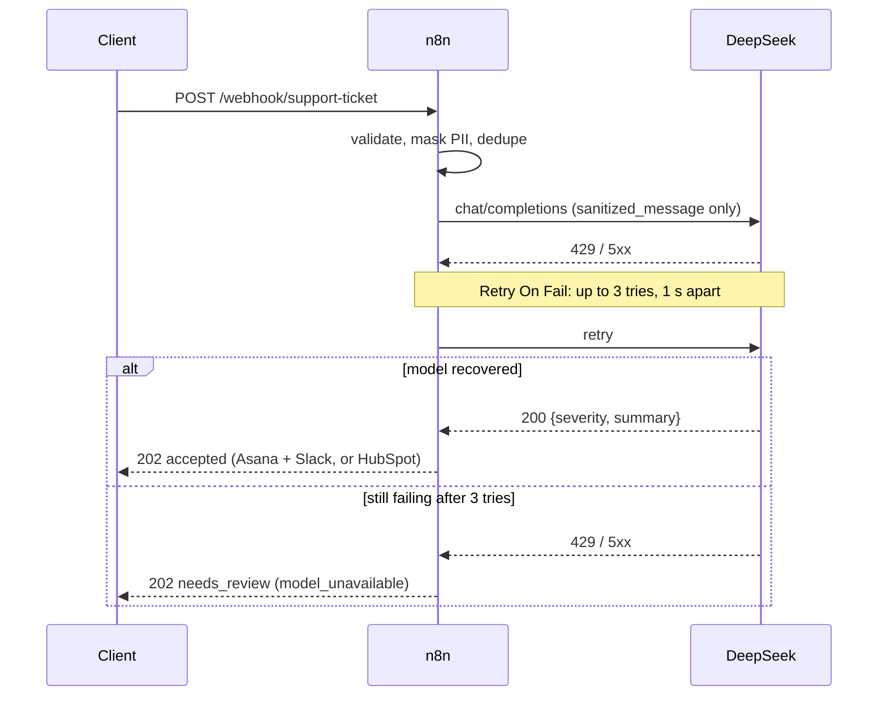

# AI Automation & Integration Engineer — take-home

Four blocks: an n8n ticket-routing workflow, a fixed Python RAG script, a PII-masking function, and a screen-recorded demo.

```
Makefile                         make test / start / smoke / stop / reset
compose.yaml                     local n8n
workflows/ticket-routing.json    Block 1
src/rag.py                       Block 2
src/pii.py                       Block 3
tests/                           workflow.test.mjs, test_pii.py, test_rag.py
```

```bash
make test
```

Offline, no Docker or keys: the Node tests check the workflow export and replay every scenario below through its real Code and IF nodes with the model stubbed; the Python tests cover `sanitize_pii` and the RAG script.

## Block 1 — n8n workflow

`POST /webhook/support-ticket` accepts `{ticket_id, customer_email, message, tier}`.



Thirteen nodes: Webhook → Validate and Mask PII → Valid Ticket? → Deduplicate Ticket → New Ticket? → Classify Ticket → Parse Classification → Classified? → Enterprise Critical? → Mock Asana Task → Mock Slack Alert | Mock HubSpot Ticket → Respond. Every branch ends in the same Respond node, which sends the item's `http_status`.

**Validation and masking.** A Code node checks the four fields and masks the message with the same rules as [src/pii.py](src/pii.py), ported to JavaScript (a test runs both over shared samples and requires identical output). Downstream nodes only ever see `sanitized_message` and `customer_email: "[REDACTED_EMAIL]"`.

**Duplicates.** `ticket_id` is the idempotency key. `Deduplicate Ticket` records each id in the workflow's static data (kept by n8n in its database, 7-day TTL) before classification, so a repeated webhook answers `200 duplicate` with no second model call, task, or alert. Single instance by nature; in production, claim the id in a database with a unique constraint.

**Classification.** An HTTP Request node sends only `sanitized_message` to DeepSeek (`deepseek-flash`, `response_format: json_object`, `max_tokens: 256`) and asks for `severity` in `Low | Medium | High | Critical` plus a short `summary`. `Parse Classification` re-validates the JSON and the enum before anything acts on it.

**Branching.** `tier == "Enterprise"` and `severity == "Critical"` → Asana + Slack mocks; everything else → HubSpot mock. The mocks build the payloads (`simulated: true`) and call nothing.

**Model outage (429 / 5xx).** The HTTP node's own *Retry On Fail* (3 tries, 1 s apart) rides out a short outage. If the error persists, the node's error output feeds `Parse Classification`, which answers `202 needs_review` with `reason: model_unavailable`; a malformed reply (not JSON, unknown severity, empty summary) ends the same way with `invalid_classification`. The ticket is never dropped and the caller never sees a 5xx; in production that branch would also enqueue the ticket for a human.



### Run it

```bash
make start   # docker compose up, import and activate the workflow
make smoke   # 4 requests: enterprise, duplicate, free tier with PII, invalid
make stop    # keep n8n's data; make reset drops it (workflows, credentials, dedupe state)
```

Open [http://localhost:5678](http://localhost:5678) (n8n asks for an owner account on first start) → *Support Ticket Routing* → *Executions* to see each request's path through the graph.

**DeepSeek key.** Lives in n8n only: Credentials → Add → DeepSeek, keep the default name `DeepSeek account`, then `make start` again — the export references the credential as `{"id": null, "name": "DeepSeek account"}` and n8n links it by name at import. Without it every valid ticket ends as `202 needs_review` after the three attempts.

Two n8n details guarded by tests: the workflow id is `ticket-routing` because n8n only persists static data for ids of at most 21 characters, and the Webhook node carries a `webhookId` because without one n8n registers the path as `<workflowId>/<node>/<path>`. The webhook has no authentication and n8n binds to `127.0.0.1` — a local demo; add auth before exposing it.

## Block 2 — RAG script fix

[src/rag.py](src/rag.py). Defects in the original snippet:

1. The function body is not indented — the script does not run.
2. `openai.Embedding.create` / `openai.ChatCompletion.create` are pre-v1 APIs; v1 uses `client.embeddings.create` and `client.chat.completions.create`.
3. `completion.choices[0].text` is the wrong path for Chat Completions — it is `.message.content`.
4. A key is hard-coded in the example call, and nothing handles exceptions.
5. The embedding is computed but never used for retrieval.
6. Raw customer text is sent to external services.

The fix: v1 client injected as a parameter (no key in code), the embedding passed to an injected retriever, PII masked in both the query and the retrieved context before any API call, empty input/context/answer rejected, API errors wrapped so request details never reach the user. A live run needs `pip install -r requirements.txt` and `OPENAI_API_KEY`; the tests use a fake client.

## Block 3 — PII masking

[src/pii.py](src/pii.py) — `sanitize_pii(text: str) -> str` for emails, international phone numbers, and Luhn-valid card numbers. The n8n `Validate and Mask PII` node uses the same regexes (see Block 1).

```python
>>> sanitize_pii("Please contact John at john.smith@company.com or call +1-202-555-0143 regarding order #4412.")
'Please contact John at [REDACTED_EMAIL] or call [REDACTED_PHONE] regarding order #4412.'
```

Regex by design rather than libphonenumber: in strict mode the library misses both assignment examples (`+1-555-0199` is not a real number, `88005553535` needs a region), and in lenient mode it over-matches the same way a regex does. Masking errs on the safe side — a 10–15 digit run with phone-style separators (8+ after a `+`) is treated as a phone number, so long invoice numbers or IP addresses may be masked too; short references like `#4412`, `TK-9082`, `500 error` are left alone.

## Block 4 — screen recording

English Loom, microphone on, writing and testing `sanitize_pii` — linked in the submission email, not in this repository.
